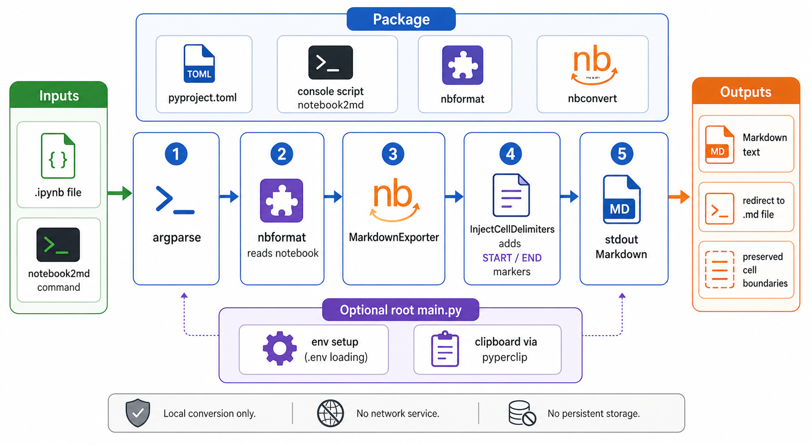

<div align="center">
  

  **📓 Convert Jupyter Notebooks to Markdown with cell structure preserved ✨**
</div>

notebook2md is a small Python CLI that converts Jupyter Notebook files (`.ipynb`) into Markdown. It keeps notebook cell boundaries visible by wrapping each code and markdown cell with delimiter comments.

Use it when you want Markdown output that can still be mapped back to the original notebook cells during review, editing, or conversion workflows.

## Install

```bash
git clone https://github.com/tsilva/notebook2md.git
cd notebook2md
pipx install . --force
```

Run it from anywhere after installation:

```bash
notebook2md notebook.ipynb > output.md
```

## Commands

```bash
notebook2md path/to/notebook.ipynb           # print converted Markdown to stdout
notebook2md path/to/notebook.ipynb > out.md  # write converted Markdown to a file
```

## Output

```markdown
<-- START:0:markdown -->
# This is a markdown cell
<-- END:0:markdown -->

<-- START:1:code -->
print("This is a code cell")
<-- END:1:code -->
```

## Notes

- Requires Python 3.12 or newer.
- The packaged `notebook2md` command uses `src/notebook2md/main.py` and writes to stdout.
- The root-level `main.py` is a separate extended script with clipboard and environment setup code, but it is not the packaged CLI entry point.
- Cell delimiters are inserted only for `code` and `markdown` notebook cells.
- The conversion runs locally with `nbformat` and `nbconvert`; there is no network service or persistent storage.

## Architecture



## License

[MIT](LICENSE)
